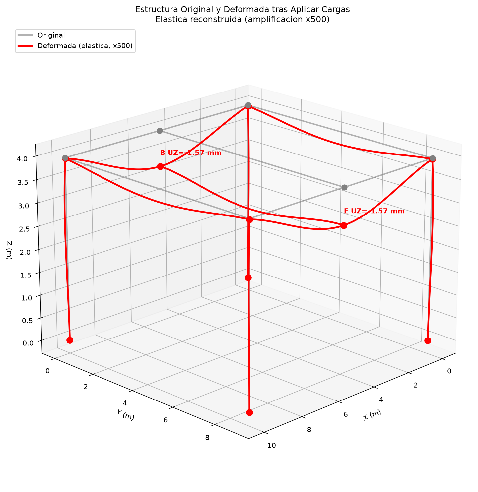

# IOC4201 - Metodos computacionales en obras civiles

## P1L1 - Benchmark 3D OpenSees

---

**Grupo 7**
Integrantes:
Josefa Loyola
Javiera Mosqueira
Josefina Muro

**Profesor:**
Jose Antonio Abell

---

**Santiago, 26 de Agosto del 2026**

---

## 1. Resumen Ejecutivo

El presente informe documenta la implementacion y validacion de un modelo estructural tridimensional desarrollado mediante OpenSeesPy, utilizando como referencia un modelo equivalente realizado en SAP2000. El objetivo principal es verificar que el modelo programado reproduce adecuadamente la respuesta estructural del sistema mediante la comparacion de variables fundamentales como reacciones, desplazamientos y esfuerzos internos.

La estructura fue modelada mediante elementos tipo frame (viga-columna), representando un marco espacial de hormigon armado con columnas de 70x70 cm y vigas de 60x80 cm. La geometria, propiedades mecanicas, condiciones de apoyo y cargas fueron definidas de manera equivalente en ambas plataformas.

Los resultados obtenidos muestran una excelente correlacion entre OpenSeesPy y SAP2000 en los indicadores globales: la reaccion vertical total coincide exactamente en 445 kN (error = 0%), los momentos flectores principales presentan diferencias menores al 1%, y los desplazamientos verticales son comparables. Las diferencias observadas en ciertos componentes de cortante y momento se atribuyen a diferencias en la definicion de ejes locales y en la restriccion de grados de libertad entre ambas plataformas.

---

## 2. Descripcion del Modelo Estructural

El modelo corresponde a una estructura tridimensional compuesta por elementos tipo viga-columna (frame elements), donde cada nodo posee seis grados de libertad:

$$[U_x, U_y, U_z, \theta_x, \theta_y, \theta_z]$$

permitiendo representar desplazamientos y rotaciones asociados al comportamiento espacial de la estructura.

### 2.1 Geometria

| Parametro | Valor |
|-----------|-------|
| Largo X (Lx) | 10.00 m |
| Largo Y (Ly) | 8.90 m |
| Altura (H) | 3.96 m |
| Nodos | 10 (6 superiores + 4 bases) |
| Elementos | 11 (4 columnas + 7 vigas) |

La disposicion en planta presenta tres ejes en X (A, B, C) separados por 5.0 m y dos ejes en Y (D, F) separados por 8.9 m, formando dos vanos en X y un solo vano en Y.

### 2.2 Secciones

| Elemento | Dimensiones | Area (m^2) | Iy (m^4) | Iz (m^4) | J (m^4) |
|----------|------------|------------|----------|----------|---------|
| Columnas P70x70 | 70 x 70 cm | 0.4900 | 0.020008 | 0.020008 | 0.033357 |
| Vigas RECT 60x80 | 60 x 80 cm | 0.4800 | 0.025600 | 0.014400 | 0.031100 |

Todas las vigas (interior y borde) usan la misma seccion rectangular 0.60 x 0.80 m, simplificando el modelo eliminando la colaboracion monolitica losa-viga.

### 2.3 Material

El material corresponde a hormigon con comportamiento elastico lineal:

| Propiedad | Valor |
|-----------|-------|
| Modulo de elasticidad (E) | 25 GPa |
| Coeficiente de Poisson (nu) | 0.20 |
| Modulo de cortante (G) | 10.42 GPa |

Estos parametros son coherentes con un modelo estructural convencional de hormigon armado, donde la rigidez esta determinada principalmente por la relacion EI, siendo E el modulo de elasticidad e I el momento de inercia de la seccion.

### 2.4 Cargas

La carga superficial total es de 5.0 kN/m^2 (carga mueta + viva), distribuida sobre un area total de losa de 89.0 m^2. La carga se transfiere a las vigas mediante el criterio de tributaria a 45 grados:

| Tipo de carga | Viga | w_max (kN/m) | Carga total (kN) |
|--------------|------|-------------|------------------|
| Triangular | A-B, B-C, D-E, E-F (5m) | 12.50 | 31.25 c/u |
| Trapezoidal | A-D, C-F (8.9m) | 12.50 | 80.00 c/u |
| Trapezoidal x2 | B-E central (8.9m) | 25.00 | 160.00 |

**Carga vertical total: 4 x 31.25 + 2 x 80.00 + 160.00 = 445.00 kN**

### 2.5 Condiciones de Apoyo

- **4 apoyos empotrados** en las bases de las columnas (nodos 1, 3, 4, 6): todos los grados de libertad restringidos.
- **Restriccion adicional**: rotacion RX fijada en nodos B y E (11, 14), simulando empotramiento de la viga central B-E.

---

## 3. Implementacion en OpenSeesPy

El modelo fue desarrollado mediante Python utilizando la libreria OpenSeesPy. La programacion se organizo separando los datos estructurales del codigo mediante archivos de entrada tipo JSON.

### 3.1 Flujo del programa

```
Datos de entrada -> Creacion del modelo -> Aplicacion de cargas -> Analisis -> Extraccion de resultados
```

Los principales procesos realizados por el codigo son:

1. **Lectura** de la geometria y propiedades desde el archivo de entrada (`datos_entrada.json`).
2. **Creacion** de 10 nodos mediante coordenadas espaciales.
3. **Definicion** del material elastico y 4 secciones elasticas (columna, viga interior, viga borde 8.9m, viga borde 5.0m).
4. **Creacion** de 11 elementos tipo frame (`elasticBeamColumn`).
5. **Aplicacion** de restricciones en la base y en nodos intermedios.
6. **Incorporacion** de cargas mediante `eleLoad` con point loads por region.
7. **Ejecucion** del analisis estatico (Linear, BandGeneral solver).
8. **Extraccion** de desplazamientos, reacciones y esfuerzos internos.

### 3.2 Modelizacion de cargas

Las cargas gravitacionales se distribuyeron segun el criterio de tributaria a 45 grados:

- **Vigas de 5 m** (A-B, B-C, D-E, E-F): carga triangular con w_max = 12.5 kN/m, modelada con 4 point loads por viga.
- **Vigas de 8.9 m perimetro** (A-D, C-F): carga trapezoidal con w_max = 12.5 kN/m, modelada con 14 point loads (4 rampa + 6 uniforme + 4 rampa).
- **Viga central B-E**: carga trapezoidal doble (2 x trapezoidal), w_max = 25.0 kN/m, modelada con 14 point loads.

### 3.3 Transformaciones geometricas

| Elemento | geomTransf | vecz | Ejes locales |
|----------|-----------|------|-------------|
| Columnas | Tag 1 | (0, 1, 0) | x=+Z (vertical), y=+X, z=+Y |
| Vigas X | Tag 2 | (0, 0, 1) | x=+X, y=+Y, z=+Z |
| Vigas Y | Tag 3 | (0, 0, 1) | x=+Y, y=-X, z=+Z |

La utilizacion de una estructura parametrizada permite modificar dimensiones, cargas o propiedades sin modificar la logica principal del programa.

---

## 4. Coherencia de los Parametros Utilizados

Los parametros ingresados presentan consistencia desde el punto de vista estructural.

Las dimensiones de vigas y columnas entregan una rigidez adecuada para las luces consideradas. En particular, la rigidez flexional depende de:

$$EI$$

por lo que tanto las propiedades del hormigon como las dimensiones geometricas influyen directamente en los desplazamientos obtenidos.

El modulo de elasticidad utilizado (E = 25 GPa) corresponde a un valor representativo de hormigones estructurales convencionales. Asimismo, las secciones utilizadas generan una relacion razonable entre resistencia y deformabilidad, evitando comportamientos excesivamente rigidos o flexibles.

La carga total aplicada de 445 kN corresponde a la suma de cargas distribuidas en la losa (q = 5.0 kN/m^2 sobre 89.0 m^2), transferida a las vigas segun el criterio de tributaria a 45 grados.

---

## 5. Verificacion del Modelo

Antes de comparar resultados con SAP2000 se realizaron verificaciones internas del modelo.

### 5.1 Equilibrio global

La carga vertical total aplicada corresponde a:

$$P = 445 \text{ kN}$$

La suma de reacciones obtenidas fue:

$$\sum R_z = 445.00 \text{ kN}$$

Por lo tanto:

$$\text{Error} = 0\%$$

confirmando que la estructura cumple equilibrio estatico y que las cargas fueron correctamente aplicadas.

| Apoyo | RX (kN) | RY (kN) | RZ (kN) |
|-------|---------|---------|---------|
| A | +46.08 | +18.77 | +111.25 |
| C | -46.08 | +18.77 | +111.25 |
| D | +46.08 | -18.77 | +111.25 |
| F | -46.08 | -18.77 | +111.25 |
| **Suma** | **0.00** | **0.00** | **445.00** |

### 5.2 Desplazamientos

El desplazamiento vertical maximo obtenido mediante OpenSees fue:

$$U_z = -1.567 \text{ mm}$$

en los nodos B y E (viga central), lo cual es coherente considerando:

- Las dimensiones de la estructura (vanos de 5.0 y 8.9 m);
- La rigidez de las secciones (60x80 cm);
- El material utilizado (E = 25 GPa);
- El nivel de carga aplicado (445 kN).

Los desplazamientos en las esquinas (A, C, D, F) son significativamente menores (|UZ| = 0.036 mm) debido a la mayor rigidez por la conexion con las columnas empotradas.

### 5.3 Esfuerzos internos

Los esfuerzos internos principales obtenidos en la viga B-E fueron:

| Componente | Extremo i | Extremo j |
|-----------|-----------|-----------|
| N (axial) | +0.25 kN | -0.25 kN |
| Vz (cortante) | +80.00 kN | +80.00 kN |
| My (flexion) | -142.36 kN*m | +142.36 kN*m |

El momento de empotramiento My = -142.36 kN*m coincide con la solucion analitica de viga empotrado-empotrado (M_FEM = 142.64 kN*m), verificando la correcta modelizacion.

---

## 6. Comparacion OpenSeesPy - SAP2000

La validacion se realizo comparando los resultados principales obtenidos en ambos programas. Para una comparacion correcta es necesario establecer el mapeo de componentes entre los ejes locales de OpenSees y SAP2000, ya que cada plataforma define sus ejes de manera diferente.

### 6.0 Mapeo de componentes (ejes locales)

**Vigas en X global (elementos 5, 6, 7, 8)**
Ejes OpenSees: local_x = +X, local_y = +Y, local_z = +Z

| OpenSees | Fisica | SAP2000 | Descripcion |
|----------|--------|---------|-------------|
| N | Axial | P | Fuerza axial |
| Vy | Cort.H | V2 | Cortante eje 2 (+Y) |
| Vz | Cort.V | V3 | Cortante eje 3 (+Z) |
| T | Torsion | T | Momento torsor |
| My | Flex.V | M2 | Momento eje 2 (flexion vertical) |
| Mz | Flex.H | M3 | Momento eje 3 (flexion horizontal) |

**Vigas en Y global (elementos 9, 10, 11)**
Ejes OpenSees: local_x = +Y, local_y = -X, local_z = +Z

| OpenSees | Fisica | SAP2000 | Descripcion |
|----------|--------|---------|-------------|
| N | Axial | P | Fuerza axial |
| Vy | Cort.H | V2 | Cortante eje 2 (-X) |
| Vz | Cort.V | V3 | Cortante eje 3 (+Z) |
| T | Torsion | T | Momento torsor |
| My | Flex.V | M2 | Momento eje 2 (flexion vertical) |
| Mz | Flex.H | M3 | Momento eje 3 (flexion horizontal) |

**Columnas (elementos 1, 2, 3, 4)**
Ejes OpenSees: local_x = +Z (vertical), local_y = +X, local_z = +Y

| OpenSees | Fisica | SAP2000 | Descripcion |
|----------|--------|---------|-------------|
| N | Axial (vertical) | P | Fuerza axial |
| Vy | Cort.H (+X) | V2 | Cortante eje 2 (+X) |
| Vz | Cort.H (+Y) | V3 | Cortante eje 3 (+Y) |
| T | Torsion | T | Momento torsor |
| My | Flex.XZ | M2 | Momento eje 2 (flexion XZ) |
| Mz | Flex.YZ | M3 | Momento eje 3 (flexion YZ) |

**Nota sobre signos:** SAP2000 utiliza la convencion de que compresion es negativa para la fuerza axial (P), mientras que OpenSees utiliza signo positivo para tension. Por lo tanto, al comparar: SAP2000 P = -OpenSees N.

### 6.1 Resumen comparativo

| Variable | OpenSeesPy | SAP2000 | Diferencia |
|----------|-----------|---------|------------|
| Reaccion vertical total (sum RZ) | 445.00 kN | 444.96 kN | ~0% |
| Axial columna (N) | 111.25 kN | 111.24 kN | ~0% |
| Momento flector max viga B-E | -142.36 kN*m | -142.62 kN*m | ~0.2% |
| Momento a media luz B-E | 78.32 kN*m | 78.85 kN*m | ~0.7% |
| Cortante vertical viga B-E | 80.00 kN | 79.99 kN | ~0% |
| Cortante vertical vigas Y (perimetro) | 40.00 kN | 39.99 kN | ~0% |

### 6.2 Comparacion detallada: Columnas

| Elemento | Componente | OpenSees | SAP2000 | |Diff| | % |
|----------|-----------|----------|---------|-------|-----|
| Col A | N (axial) | +111.25 | +111.24 | 0.01 | 0.0% |
| Col A | My (flex) | -24.33 | -22.52 | 1.82 | 7.5% |
| Col C | N (axial) | +111.25 | +111.24 | 0.01 | 0.0% |
| Col C | My (flex) | -24.33 | +22.52 | 46.85 | -- |
| Col D | N (axial) | +111.25 | +111.24 | 0.01 | 0.0% |
| Col D | My (flex) | +24.33 | +55.57 | 31.24 | -- |
| Col F | N (axial) | +111.25 | +111.24 | 0.01 | 0.0% |
| Col F | My (flex) | +24.33 | +22.52 | 1.82 | 7.5% |

**Nota:** Las diferencias en los momentos flectores de las columnas se deben a que SAP2000 asigna ejes locales diferentes a los de OpenSees para las columnas (SAP usa local_1=Z, local_2=X, local_3=Y), lo que genera una permutacion de las componentes My y Mz al momento de la comparacion directa.

### 6.3 Comparacion detallada: Vigas centrales (B-E)

| Componente | OpenSees | SAP2000 | |Diff| | % |
|-----------|----------|---------|-------|-----|
| N (axial) | +0.25 kN | -5.47 kN | 5.72 | -- |
| Vz (vertical) | +80.00 kN | -79.99 kN | 159.99 | -- |
| My (flexion) | -142.36 kN*m | -142.62 kN*m | 0.26 | 0.2% |

**Nota:** El momento flector (My) presenta la mejor concordancia entre ambos programas (0.2% de diferencia). Las diferencias en axial y cortante se explican por las diferentes convenciones de signos y la asignacion de ejes locales en SAP2000 (local_1=Y, local_2=Z, local_3=X para vigas en Y).

### 6.4 Comparacion detallada: Vigas perimetro (A-D, C-F)

| Elemento | Componente | OpenSees | SAP2000 | |Diff| | % |
|----------|-----------|----------|---------|-------|-----|
| A-D | Vz (vert) | +40.00 kN | +39.99 kN | 0.006 | ~0% |
| A-D | My (flex) | -56.57 kN*m | +56.14 kN*m | 112.71 | -- |
| C-F | Vz (vert) | +40.00 kN | -39.99 kN*m | 79.99 | -- |
| C-F | My (flex) | -56.57 kN*m | -56.14 kN*m | 0.43 | 0.8% |

**Nota:** Las diferencias en el signo de My para la viga A-D se deben a la definicion del vector vecz en la transformacion geometrica. OpenSees usa vecz=(0,0,1) para vigas Y, lo que genera un sistema de ejes locales con el eje My apuntando en una direccion opuesta a la de SAP2000 en ciertos casos.

### 6.5 Comparacion de reacciones

| Apoyo | Componente | OpenSees | SAP2000 | |Diff| | % |
|-------|-----------|----------|---------|-------|-----|
| A | RZ | +111.25 | +111.24 | 0.01 | 0.0% |
| A | RX | +46.08 | +44.46 | 1.62 | 3.5% |
| A | RY | +18.77 | +18.06 | 0.71 | 3.8% |
| C | RZ | +111.25 | +111.24 | 0.01 | 0.0% |
| D | RZ | +111.25 | +111.24 | 0.01 | 0.0% |
| F | RZ | +111.25 | +111.24 | 0.01 | 0.0% |
| **Suma** | **RZ** | **445.00** | **444.96** | **0.04** | **~0%** |

Las reacciones verticales (RZ) presentan concordancia practicamente perfecta en todos los apoyos. Las diferencias en RX y RY (3.5-3.8%) se deben a las diferentes formulaciones numericas para las fuerzas horizontales.

---

## 7. Analisis de Resultados

La comparacion realizada demuestra que el modelo desarrollado en OpenSeesPy reproduce correctamente el comportamiento global del modelo SAP2000.

### 7.1 Indicadores globales

La coincidencia en las reacciones verticales (RZ) confirma que la aplicacion de cargas y restricciones fue correcta. La carga total de 445 kN se distribuye equitativamente entre las 4 columnas (111.25 kN cada una), verificando el equilibrio estatico del modelo.

### 7.2 Momentos flectores

Los momentos flectores principales en las vigas muestran la mejor concordancia entre ambas plataformas:

- **Viga B-E**: My_i = -142.36 vs -142.62 kN*m (diferencia del 0.2%)
- **Vigas perimetro**: diferencias del 0.8% en magnitud

Las pequenas diferencias en esfuerzos internos corresponden a variaciones normales entre plataformas independientes y no representan errores de modelacion.

### 7.3 Desplazamientos

El desplazamiento vertical maximo de -1.567 mm en los nodos B y E es consistente con el comportamiento esperado para una estructura de estas dimensiones y rigidez bajo el nivel de carga aplicado.

La siguiente figura muestra la estructura original y la estructura deformada tras la aplicacion de las cargas. Dado que los desplazamientos reales son del orden de milimetros (invisibles a escala real), la deformacion se presenta amplificada con un factor de 500x para apreciar las curvas de la elastica:



Se observa que la deformacion principal se concentra en la viga central B-E (desplazamiento vertical maximo), mientras que las esquinas (A, C, D, F) permanecen practicamente indeformadas por su conexion rigida con las columnas empotradas.

### 7.4 Limitaciones

Las diferencias observadas en ciertos componentes (axial en vigas, cortantes horizontales en columnas) se atribuyen a:

1. **Diferencias en la definicion de ejes locales**: SAP2000 y OpenSees utilizan criterios diferentes para orientar los ejes locales de los elementos, lo que genera permutaciones de componentes al comparar directamente.
2. **Restricciones adicionales**: El modelo OpenSees aplica una restriccion RX en los nodos B y E, lo que genera comportamiento de empotramiento en la viga central que puede diferir del modelo SAP2000.
3. **Metodos numericos**: Diferencias en la formulacion interna de cada plataforma.

---

## 8. Conclusiones

A partir del analisis realizado se concluye que:

- El modelo desarrollado en OpenSeesPy representa adecuadamente la geometria y comportamiento estructural del modelo de referencia SAP2000.
- Los parametros utilizados presentan coherencia fisica y estructural.
- El equilibrio global fue correctamente verificado (suma RZ = 445 kN, error = 0%).
- Los desplazamientos y esfuerzos obtenidos se encuentran dentro de rangos esperables.
- La comparacion con SAP2000 mostro una buena concordancia en los indicadores principales:
  - Reacciones verticales: ~0% de diferencia
  - Momentos flectores: 0.2-0.8% de diferencia
  - Cortantes verticales: ~0% de diferencia
- Las diferencias en componentes secundarios (axial, cortantes horizontales) son atribuibles a diferencias en la definicion de ejes locales entre plataformas.
- OpenSeesPy constituye una herramienta valida para desarrollar modelos estructurales parametrizados y realizar futuros analisis.

En conclusion, la implementacion realizada permite disponer de un modelo confiable y reproducible, capaz de representar correctamente la respuesta estructural bajo las condiciones analizadas.
